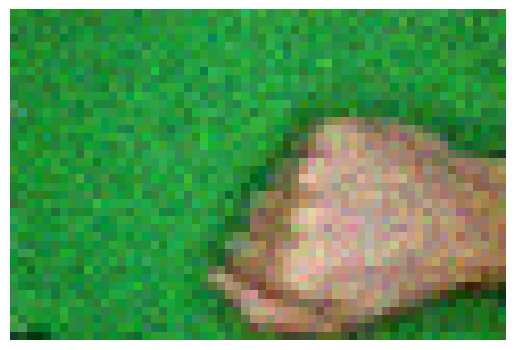
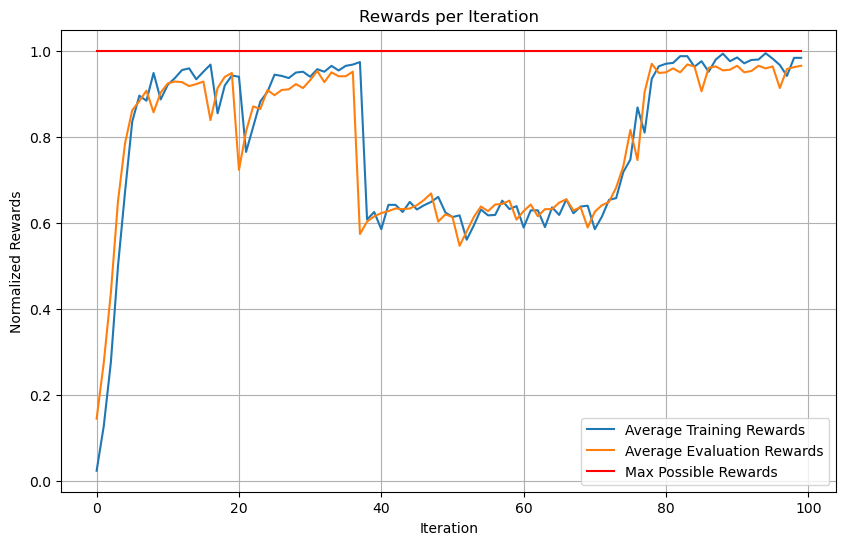
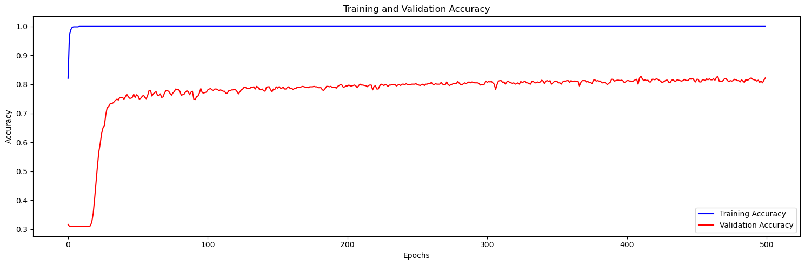

# Rock Paper Scissors Agent

---
A reinforcement learning agent trained in a custom Rock-Paper-Scissors environment 
and compared with a supervised neural network agent. 
Both RL and NN agent have similar network architectures.

## Overview

---
- **Environment**: A custom Rock-Paper-Scissors environment is created using Gymnasium. 
It includes image preprocessing and reward system based on the game's rules.
More details in the following section.
- **Reinforcement Learning Agent**: An RL agent is configured using Ray RLlib's
Proximal Policy Optimization (PPO) algorithm, incorporating a custom TensorFlow
model for image processing.
- **Neural Network Agent**: A Convolutional Neural Network (CNN) model is designed using 
TensorFlow to classify gestures from images.
- **Training and Evaluation**: Both the RL agent and the CNN model are trained and evaluated
on a dataset of hand gesture images. The training process involves iterating over
the dataset and updating the models based on their performance.
- **Comparative Analysis**: The performance of the RL agent and the CNN model is compared based
on their ability to win, tie, or lose in the Rock-Paper-Scissors game against a test dataset.
And on a different, new dataset.
- **Datasets**: The primary dataset used for training is sourced from Kaggle's "Rock-Paper-Scissors"
dataset (available [here](https://www.kaggle.com/datasets/drgfreeman/rockpaperscissors)).
An additional dataset, also from Kaggle, titled "RockPaperScissors"
(available [here](https://www.kaggle.com/datasets/yash811/rockpaperscissors/data))
is utilized for further evaluation and testing.

## Dependencies

---
* Python 3.8 or later
* TensorFlow 2.x
* Gymnasium 0.26.3
* Ray RLlib 2.3.1
* OpenCV
* Numpy
* Matplotlib

You can install these requirements via `pip install` or `conda install`,
depending on your package manager.

## Environment Details

---
The '**RockPaperScissorsEnv**' class is a custom environment designed for the Rock-Paper-Scissors game,
built using the Gymnasium library. This environment is an integral part of the notebook,
facilitating the training and evaluation of both the reinforcement learning agent
and the neural network agent.

### Initialization ('*\_\_init\_\_*' method)
* **Environment Configuration**: The constructor accepts an 'env_config' dictionary,
allowing configuration of parameters like whether the environment is in training mode ('train'),
the dataset path ('dataset_path'), and probabilities for vertical ('p_ver')
and horizontal ('p_hor') flipping of images.
* **Image and Gesture Loading**: The '_load_data' static method loads images
and their corresponding gestures (rock, paper, scissors) from the specified dataset.
The dataset is split into training and testing sets.
* **Action and Observation Space**: The 'action_space' is discrete with three possible actions
(0: rock, 1: paper, 2: scissors). The 'observation_space' is a box space representing RGB images
of size 40x60x3 pixels.
### Image Preprocessing ('*preprocess_image*' static method)
* This method applies random vertical and horizontal flips to the images based
on specified probabilities ('p_ver', 'p_hor').
* Gaussian noise is added to the images.
* The images are clipped to ensure pixel values remain within valid ranges.

### Environment Dynamics
* **Reset ('reset' method)**: Resets the environment to its initial state. 
It selects a random image and its corresponding gesture from the dataset as the current observation.
* **Step ('step' method)**: The core of the environment's dynamics,
this method updates the environment's state based on the agent's action.
It returns a tuple containing the new observation (next image), the reward,
and flags indicating if the episode has terminated or truncated.
* **Reward ('get_reward' static method)**: This method calculates the reward based on the classic
rules of Rock-Paper-Scissors. The reward system is designed to reflect the outcome
of a single round of the game (win {1}, lose {-1}, tie {0}).

### Example of Observation Image

Below is an example of an observation image that the models receive as input:

This pixelated image of a hand gesture is preprocessed and then used by the models to predict the
corresponding move in the Rock-Paper-Scissors game.

## Results

---

### Reinforcement Learning Agent Training Results

The graph above illustrates the normalized rewards per iteration for the reinforcement learning
agent. The blue line represents the average training rewards, while the orange line depicts
the average evaluation rewards. The red line indicates the maximum possible rewards the agent
can achieve.

### Supervised Neural Network Training Results

This graph displays the training and validation accuracy of the neural network model over 500 epochs.
The blue line shows the accuracy on the training set, while the red line shows the accuracy
on the validation set.

### Performance Evaluation
#### Evaluation on Training Dataset
* Reinforcement Learning Agent:
  * Wins: 639
  * Ties: 9
  * Loses: 9
* Neural Network Model:
  * Wins: 591 
  * Ties: 30 
  * Loses: 36

The RL agent demonstrates a higher win rate and fewer losses compared to the NN model
on the dataset that was also used for training.

#### Evaluation on New Dataset
* Reinforcement Learning Agent:
  * Wins: 252
  * Ties: 258
  * Loses: 305
* Neural Network Model:
  * Wins: 270
  * Ties: 275
  * Loses: 270

On the new dataset, both models show a balanced distribution of wins, ties, and losses.
This suggests that both of them are not able to predict correctly the new data.
The contrast in performance of the models on the training dataset versus the new dataset could
be attributed to differences in the style or quality of the images between the two datasets.
The first dataset have green background, while the other doesn't. When models encounter
a new style of data that significantly deviates from their training examples,
their performance can degrade. This can be reveled as a more balanced distribution
of wins, ties, and losses, as neither model may have a clear understanding in 
predicting gestures they haven't been exposed to during training.

## Conclusion

---
This notebook demonstrates the process of setting up a custom environment for a simple game,
training both a reinforcement learning agent and a neural network, and evaluating their performance.
It provides a practical example of applying deep learning and reinforcement learning techniques
in a game-like scenario.
